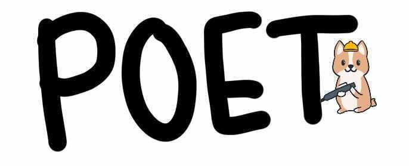

# Useful tools and links

## Setting up and using POET

Coming soon...

## Useful links

* [CORGI](http://corgi.openstax.org/)
* [ABL](https://github.com/openstax/content-manager-approved-books/blob/master/approved-book-list.json)

